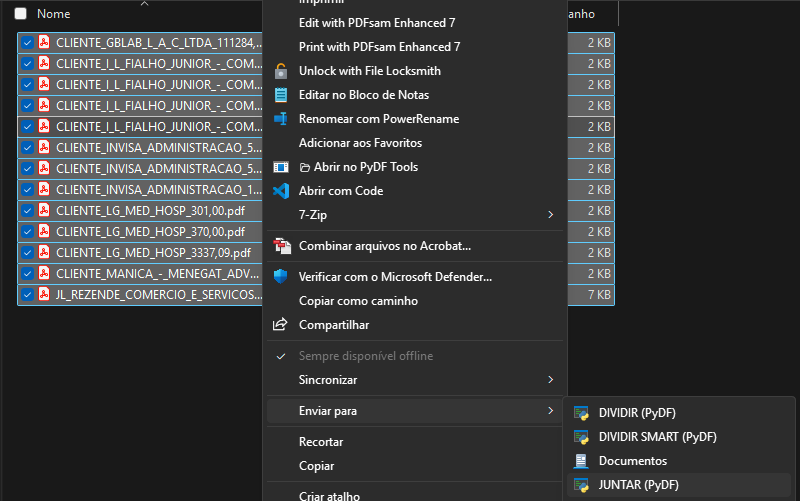
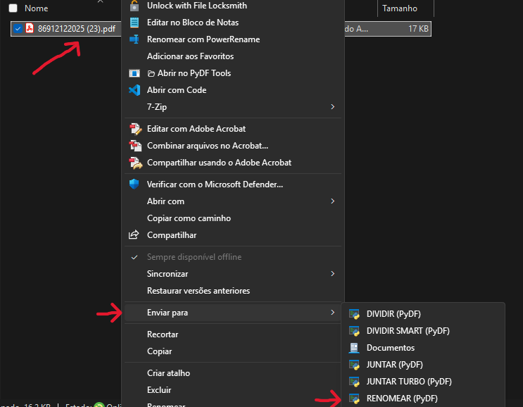
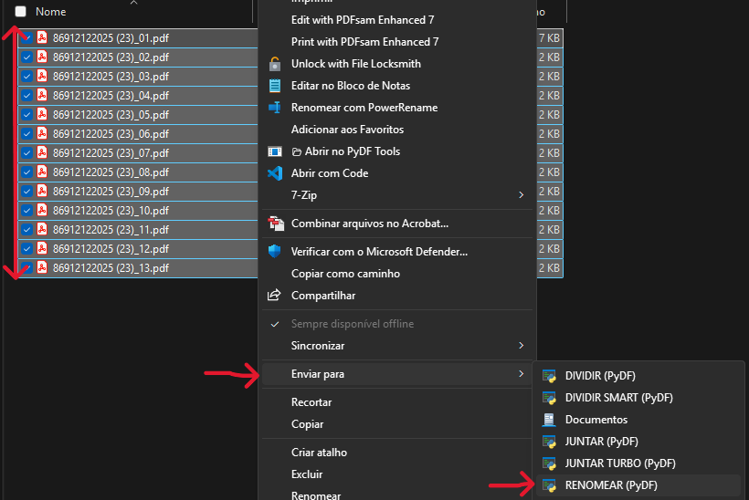

📂 PyDF Toolkit - Windows PDF Automation

Uma suíte de ferramentas leve, local e automatizada para manipulação de PDFs, integrada diretamente ao Menu de Contexto do Windows.

📖 Sobre o Projeto

O PyDF Toolkit foi desenvolvido para resolver a ineficiência de manipular documentos PDF no dia a dia corporativo. Ao invés de depender de softwares pesados (Adobe) ou ferramentas online inseguras (iLovePDF), este projeto oferece uma solução nativa, rápida e privada.

O diferencial é a integração via Shell (Batch Scripting), permitindo que o usuário execute scripts Python complexos simplesmente clicando com o botão direito no arquivo ("Enviar Para").

🚀 Funcionalidades

1. Fatiar (Split)

Divide um arquivo PDF em páginas individuais instantaneamente.

Criação automática de pastas organizadas.

Nomenclatura sequencial.

2. Fatiar Inteligente (Smart Split)

Utiliza Regex e Extração de Texto para ler o conteúdo de cada página antes de salvar. Ideal para separar comprovantes ou notas fiscais misturados.

Lógica: Se encontrar um valor monetário (ex: "1.500,00"), renomeia o arquivo com o valor. Se não, usa um contador padrão.

3. Juntar (Merge)

Unifica todos os PDFs de uma pasta em um único arquivo Unificados.pdf ou com nome personalizado.

4. Renomeação Automática (OCR Logic)

O motor principal do projeto. Analisa o texto de boletos, comprovantes PIX ou extratos para identificar o tipo de documento e renomeá-lo automaticamente com precisão contábil.

Detecta padrões: PIX, BOLETO, DARF, EXTRATO.

Opções: Organiza por Favorecido, Data (ISO), Valor e Tipo.

<em>Visualização do Processo e Log Detalhado</em>

🏗️ Arquitetura e Tecnologias

O projeto utiliza uma arquitetura híbrida para garantir a melhor UX no Windows. O fluxo de dados conecta a interface nativa do Explorer diretamente ao Core Python através de Wrappers Batch.

Core (Python): Scripts robustos usando pypdf para manipulação de bytes e re (Regex) para lógica de extração.

Wrapper (Batch): "Ponte" que configura o ambiente (UTF-8) e gerencia a execução.

Instalador: Script de auto-diagnóstico e injeção de atalhos.

📂 Estrutura do Projeto

A organização dos arquivos foi pensada para facilitar a manutenção, separando a lógica de negócio (Python) dos executáveis de sistema (Bat).

📦 Instalação e Uso

O projeto conta com um Instalador CLI Interativo.

Entre na pasta e execute o instalador:

cd pydf-toolkit
Instalador_PyDF.bat

Finalizando a Instalação

No menu do instalador, escolha a opção [3] INSTALAR / REPARAR.

O script verificará se o Python está instalado, instalará a dependência pypdf automaticamente e criará os atalhos no menu de contexto.

Como usar:

Clique com o botão direito em qualquer PDF (ou pasta, dependendo da função).

Vá em Enviar Para e escolha a função desejada (ex: 01 - DIVIDIR (PyDF)).

O script rodará e fechará automaticamente após o sucesso.

🧪 Testes Automatizados

Qualidade de código é prioridade. O projeto inclui um sistema de auto-diagnóstico (teste_sistema.py) que:

Cria PDFs "Mock" (falsos) para teste em tempo real.

Executa todas as funções do sistema em ambiente isolado.

Valida se os arquivos de saída foram criados corretamente.

Limpa o ambiente após o teste.

Para rodar os testes, execute o instalador e escolha a opção [4] TESTE DE SISTEMA.

📝 Licença

Este projeto está sob a licença MIT - sinta-se livre para usar e modificar.

<strong>Desenvolvido por Pedro Tavares</strong>

<em>Estudante de Ciência da Computação & Desenvolvedor Full Cycle em formação.</em>

